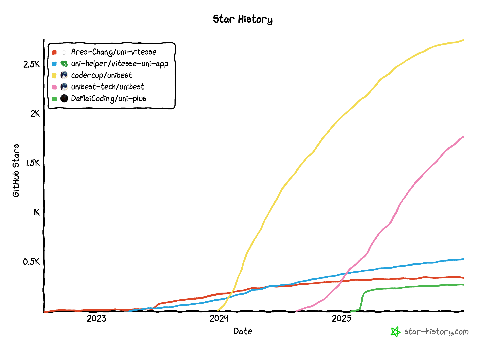

# 简介

<div class="md-center" style="margin-top: 20px;">

[](https://github.com/codercup/unibest)
[](https://github.com/feige996/unibest)
[](https://gitee.com/codercup/unibest)


</div>

> 上面前 2 个 `star` 分别是旧仓库 `codercup` 和新仓库 `feige996` 的 `star` 数。

`unibest` 是最好的 `uniapp` 开发框架，由 `uniapp` + `Vue3` + `Ts` + `Vite5` + `UnoCss` + `VSCode`(可选 `webstorm`) + `uni插件`+ `wot-ui`（可选其他 UI 库）构建，集成了多种工具和技术，使用了最新的前端技术栈，无需依靠 `HBuilderX`，通过命令行方式即可运行 `web`、`小程序` 和 `App`。（注：`App` 还是需要 `HBuilderX`）

`unibest` 内置了 `约定式路由`、`layout布局`、`请求封装`、`请求拦截`、`登录拦截`、`UnoCSS`、`i18n多语言` 等基础功能，提供了 `代码提示`、`自动格式化`、`统一配置`、`代码片段` 等辅助功能，让你编写 `uniapp` 拥有 `best` 体验 （ `unibest 的由来`）。

`unibest` 默认支持所有的 `uniapp` 平台（`H5`、`小程序` 和 `App`），但是具体支持情况还要看您所选的 `UI 库` 是否支持。

## ⭐ Star History

同类模板对比实时地址：[https://www.star-history.com/#Ares-Chang/uni-vitesse&uni-helper/vitesse-uni-app&codercup/unibest&unibest-tech/unibest&DaMaiCoding/uni-plus&Date](https://www.star-history.com/#Ares-Chang/uni-vitesse&uni-helper/vitesse-uni-app&codercup/unibest&unibest-tech/unibest&DaMaiCoding/uni-plus&Date)

如图所示，两个高高的都是 `unibest`，分别是新旧仓库。

黄色的是旧的 `codercup`，秘钥丢失，进不去了。粉色的新的仓库（`unibest-tech`），目前正在积极维护。



## 🗂 生成过程

`unibest` 由最初始的官方 cli 脚手架模板生成，执行的命令如下：

```sh
npx degit dcloudio/uni-preset-vue#vite-ts my-vue3-project
```

`uniapp` 官方链接：[点击跳转 - quickstart-cli](https://uniapp.dcloud.net.cn/quickstart-cli.html)

在官方生成的项目基础上，增加了如下内容：

- 前端基础配置六件套
  - prettier
  - eslint
  - stylelint
  - husky
  - lint-staged
  - commitlint
- UnoCSS
- UnoCSS Icons
- Uni 插件
  - vite-plugin-uni-pages
  - vite-plugin-uni-layouts
  - vite-plugin-uni-manifest
  - vite-plugin-uni-platform
- ku/root 插件
- UI 库（默认 `wot-ui`，支持替换其他 `UI库`)
- pinia + pinia-plugin-persistedstate
- 通用功能
  - 请求封装
  - 请求拦截
  - 路由拦截

## ✨ 特性

- ⚡️ [Vue 3](https://github.com/vuejs/core), [Vite](https://github.com/vitejs/vite), [pnpm](https://pnpm.io/), [esbuild](https://github.com/evanw/esbuild) - 就是快！

- 🔥 最新语法 - `<script lang="ts" setup>` 语法

- 🎨 [UnoCSS](https://unocss.dev/) - 高性能且极具灵活性的即时原子化 CSS 引擎

- 😃 [UnoCSS Icons](https://unocss.dev/presets/icons) & [icones](https://icones.js.org/) - 海量图标供你选择

- 🍍 [pinia](https://pinia.vuejs.org/) & [pinia-plugin-persistedstate](https://prazdevs.github.io/pinia-plugin-persistedstate/zh/guide/) - 全端适配的全局数据管理

- 🗂 `uni.request` 请求封装 - 一键引入，快捷使用

- 📦 `路由拦截` 基础封装，支持扩展，快捷使用，拒绝黑盒

- 📥 [API 自动加载](https://github.com/antfu/unplugin-auto-import) - 直接使用 Composition API 无需引入

- 🎉 `v3` Code Snippets 加快你的页面生成

- 🦾 `Pritter` & `ESLint` & `Stylelint` & `husky` & `lint-staged` + `commitlint` - 保证代码质量

- 🌈 `TypeScript` 加持，同时又兼容 `js` ，同时满足不同人群

- 💡 `ES6 import` 自动排序，`css 属性` 自动排序，增强编码一致性

- 🖥 `多环境` 配置分开，想则怎么配置就怎么配置

## 📦 目录结构

### 本仓库结构（CLI 开发者）

```
unibest/                    # 主仓库（main 分支）
├── packages/
│   └── cli/                # CLI 脚手架工具（发布到 npm）
├── src/                    # 模板源码
└── 其他配置文件
```

> CLI 会从 `base` 分支拉取基础代码生成用户项目。

### 用户项目结构（创建项目后）

```
my-project/                 # 用户项目
├── src/                    # 源码
├── pages.json              # 页面配置
├── manifest.json           # 应用配置
├── App.vue                 # 应用入口
├── main.ts                 # 入口文件
└── 其他配置文件
```

> 用户项目不包含 `packages/` 目录。

## 🏗️ 项目架构

unibest 采用 **Monorepo** 架构设计，包含两部分：

1. **模板源码** - 用户创建项目的基础代码
2. **CLI 脚手架** - `packages/cli/` 目录，发布到 npm 包 `create-unibest`

**用户使用流程：**
```
pnpm create unibest my-project
         ↓
安装 create-unibest 包（npm）
         ↓
从 Git base 分支克隆模板
```

> 详细的用户项目目录结构，请查看 [快速开始篇](./2-start)。

## 🗂 生成过程
│   │   ├── config.ts
│   │   ├── index.vue
│   │   ├── README.md
│   │   ├── store.ts
│   │   └── types.ts
│   ├── types
│   │   ├── async-component.d.ts
│   │   ├── async-import.d.ts
│   │   ├── auto-import.d.ts
│   │   ├── components.d.ts
│   │   └── uni-pages.d.ts
│   ├── typings.d.ts
│   ├── typings.ts
│   ├── uni_modules
│   │   └── .gitkeep
│   ├── uni.scss
│   └── utils
│       ├── debounce.ts
│       ├── index.ts
│       ├── systemInfo.ts
│       ├── toLoginPage.ts
│       ├── updateManager.wx.ts
│       └── uploadFile.ts
├── tsconfig.json
├── uno.config.ts
├── vite-plugins
│   ├── copy-native-resources.ts
│   ├── README.md
│   └── sync-manifest-plugins.ts
└── vite.config.ts
```
