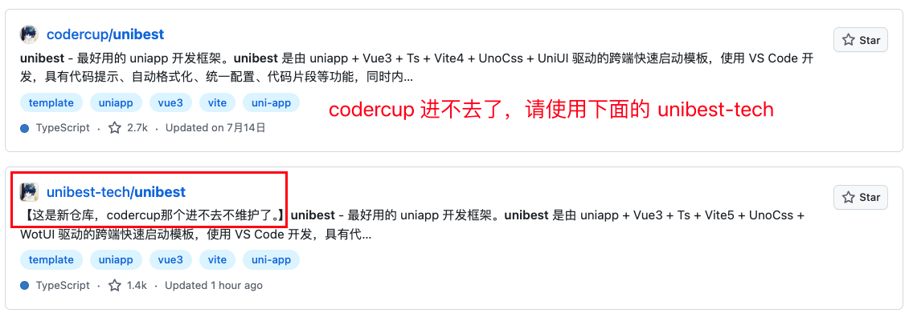

# 项目仓库

- `github` 项目仓库: <https://github.com/unibest-tech/unibest>
- `gitee` 项目仓库: <https://gitee.com/feige996/unibest>

## codercup 停止维护

2023 年 6 月，新公司征用电脑并格式化电脑，导致我把 `2fa 验证工具` 和 `recover code` 都弄没了，无法登录 `codercup`。

`codercup` 无法登录，故停止维护。后来新开了仓库来继续维护 `unibest`，仓库地址为：<https://github.com/unibest-tech/unibest>。

但是我看到还有不少人在 `codercup` 提交 `issue` 和 `star`, 这里提醒一下。

## 如何进入正确的仓库地址

从 `unibest` 官网右上角点击 `github图标` 即可进入正确的仓库地址。

