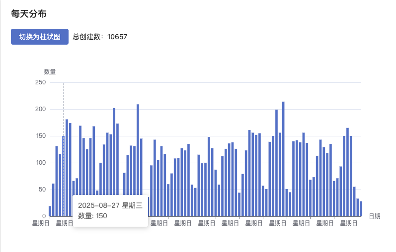
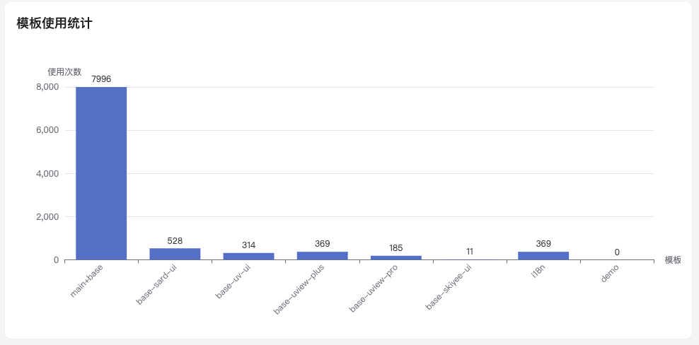

# 谁在用 unibest

有 `10w+` 员工的大公司在用，也有很多 `中小公司` 和 `个人开发者` 在使用 `unibest`。

> 之前有个群友就跟我说，他公司 `10w+` 员工，他准备在公司推广 `unibest` ^\_^

## 交流群人数

目前有 `16` 个交流群，微信 `10` 个，QQ `6` 个。共计 `3000+` 群友。

> 微信目前不再提供免费交流群，详情请见 [微信交流群](../reference/contact)

## 项目统计

每天都有 `100+` unibest 项目诞生，从 5 月 31 号统计以来，有 `1w+` 个 `unibest` 项目诞生。

## 模板统计

## 数据源

数据我都存在 `laf` 里面，有需要的可以通过接口自取：

- 所有的数据（分页）：https://ukw0y1.laf.run/create-unibest/getBeacon
- 每天的项目数：https://ukw0y1.laf.run/create-unibest/getBeaconByDay

> 后续会直接图表的形式展示，等我有空，我去整理和部署出来。
